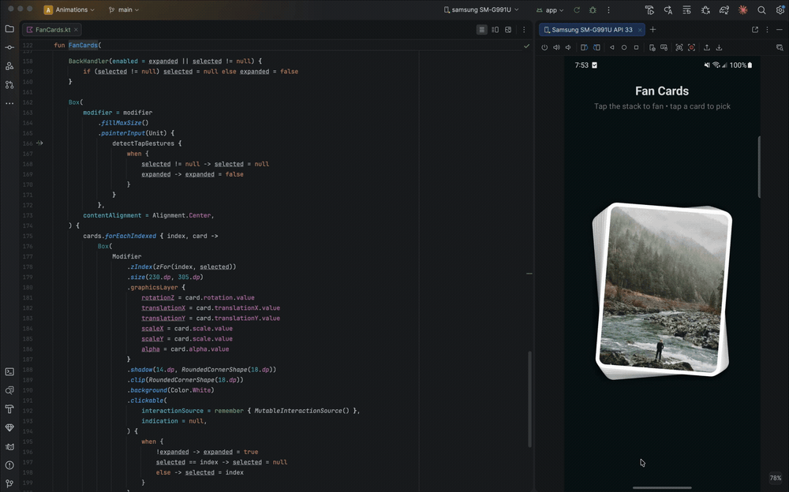

# Fan Cards (Jetpack Compose)

A reusable, three-state card stack built with Jetpack Compose.
A neat pile of cards fans out into an arc on tap, then lets you lift a single
card to the front — all driven by spring physics.

---

## Preview

---

## Overview

This component shows a list of images as a stacked deck. It moves through
three states:

1. **Stacked** — cards sit in a tight, slightly offset pile
2. **Fanned** — tap the pile and the cards spread into a curved arc
3. **Selected** — tap a card and it scales up front-and-center while the rest
   shrink and fade into a small row behind it

Tapping the background (or the system back button) steps back one state at a
time: selected → fanned → stacked.

---

## Key Features

- Three-state machine (stacked / expanded / selected) from two booleans
- Spring physics on every property (rotation, translation, scale, alpha)
- Cards fan along a real arc using `sin`/`cos` around a pivot radius
- Staggered spread — each card starts `22ms` after the previous one
- Selected card lifts to `zIndex 1000`, others dim and tuck behind
- `BackHandler` integration — back button unwinds one state per press
- Tap background to collapse; tap a card to select / deselect
- Works with any list of image URLs (loaded with Glide)

---

## Animation Concept

Each card's look for a given state is a pure function, `targetFor(pos, size,
expanded, selected)`, returning a `Target` (rotation, translationX/Y, scale,
alpha). A parallel `CardAnim` holds one `Animatable` per property, and a
`LaunchedEffect` keyed on `(expanded, selected)` springs every card toward its
new target whenever the state changes.

The four states map to four target shapes:

- **Stacked** — tiny per-index offset (`off * 1.5°`, small x/y) for a "deck"
  look
- **Expanded** — angle interpolated across `±SPREAD`, then translated along an
  arc of radius `PIVOT` via `sin`/`cos`, so cards curve like a hand of cards
- **Selected (this card)** — centered, no rotation, scaled up to
  `SELECTED_SCALE`
- **Selected (other cards)** — pushed up and back into a small faded row at
  `UNSELECTED_SCALE`

Because targets flow through springs, transitions between any two states are
smooth and interruptible. When fanning out (`selected == null`) each card is
delayed by `index * 22ms` for a cascading spread; selection changes fire
immediately.

---

## Data Model

- `Target` — the resting values (rotation, x, y, scale, alpha) for a card in a
  given state
- `CardAnim` — one `Animatable<Float>` per property, created per card
- `targetFor(...)` — pure state → `Target` mapping (the whole layout lives here)
- `zFor(pos, selected)` — z-order, lifting the selected card above the rest
- `expanded` / `selected` — the two pieces of state that drive everything

---

## How to Use

    FanCards(
        photos = listOf(
            "https://picsum.photos/id/1080/600/600",
            "https://picsum.photos/id/1074/600/600",
            // ...
        ),
    )

Tap the stack to fan the cards out, tap a card to lift it to the front, and
tap the background (or press back) to step back down. No callbacks to wire up —
the component owns its own expanded/selected state.

See `FanCardsDemo.kt` for a complete example.

---

## Parameters

| Parameter  | Default    | Description                    |
|------------|------------|--------------------------------|
| `photos`   | required   | List of image URLs             |
| `modifier` | `Modifier` | Applied to the outer container |

---

## Tuning

The fan geometry is controlled by top-level constants in `FanCards.kt`:

| Constant           | Default            | Description                                 |
|--------------------|--------------------|---------------------------------------------|
| `SPREAD`           | `32f`              | Max fan angle (degrees) on each side        |
| `PIVOT`            | `360f`             | Arc radius the cards curve along            |
| `SELECTED_SCALE`   | `1.35f`            | Scale of the picked card                    |
| `UNSELECTED_SCALE` | `0.62f`            | Scale of the other cards when one is picked |
| `cardSpring`       | `0.72 / MediumLow` | Damping / stiffness for all cards           |

Card size is fixed at `230 × 305 dp` in the layout — adjust there if needed.

---

## File Structure

    fan_cards/
    ├── FanCards.kt         ← Reusable component (copy this one file)
    │   ├── FanCards()      ← Main composable + state machine
    │   ├── targetFor()     ← State → resting transform per card
    │   ├── CardAnim/Target ← Per-card animation holders
    │   └── zFor()          ← Z-ordering for the selected card
    │
    └── FanCardsDemo.kt     ← Usage example

---

## Notes

- Uses Glide (`GlideImage`) for image loading — swap for Coil if preferred
- All motion is `graphicsLayer` + `Animatable` — no shaders or bitmap work
- Best for a handful of cards (a hand-sized deck), not long lists
- The whole layout is one pure function, so it is easy to retune or extend
  with new states

---